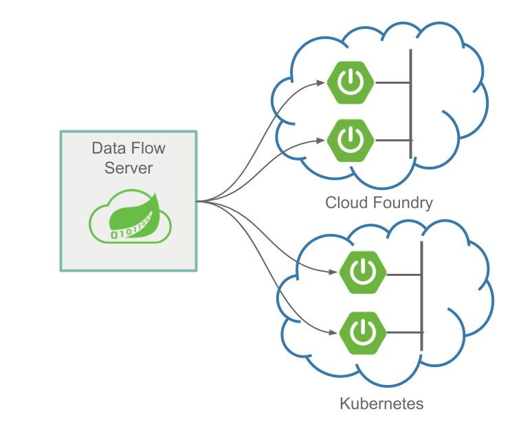

# Stream Processing

Stream processing is defined as the processing of an unbounded amount of data without interaction or interruption.
Business cases for stream processing include:

- Real-time credit card fraud detection or predictive analytics
- Near-real-time business data processing for actionable analytics

Stream processing in Spring Cloud Data Flow is implemented architecturally as a collection of independent event-driven streaming applications that connect using a messaging middleware of choice, for example RabbitMQ or Apache Kafka.
The collection of independent applications come together at runtime to constitute a streaming data pipeline.
The pipeline can be linear or non-linear, depending on the data flows between the applications.

## Messaging Middleware

Deployed stream applications communicate over a messaging middleware product.
We provide pre-built stream applications that communicate over [RabbitMQ](https://www.rabbitmq.com) or
[Kafka](https://kafka.apache.org) and that you can use to integrate with various data products.

Through the use of one of many [Spring Cloud Stream Binders](https://cloud.spring.io/spring-cloud-stream/#binder-implementations),
you can use many different messaging middleware products. Spring Cloud Data Flow supports the following popular platforms:

- [Kafka Streams](https://kafka.apache.org/documentation/streams/)
- [Amazon Kinesis](https://aws.amazon.com/kinesis/)
- [Google Pub/Sub](https://cloud.google.com/pubsub/docs/)
- [Solace PubSub+](https://solace.com/software/)
- [Azure Event Hubs](https://azure.microsoft.com/en-us/services/event-hubs/)

You can find more information (such as the current list of Spring Cloud Stream Binders) [here](https://cloud.spring.io/spring-cloud-stream/#binder-implementations).

## Spring Cloud Stream

For Spring developers, we suggest writing custom Stream applications by using the [Spring Cloud Stream](https://spring.io/projects/spring-cloud-stream) framework. Spring Cloud Stream lets you easily build highly scalable event-driven microservices connected with shared messaging systems.

As a developer, you can focus on developing the application’s business logic while delegating the underlying API complexity and connectivity boilerplate with the message broker to Spring Cloud Stream.

At a high level, streaming applications can produce, process, or consume events through the messaging middleware.

## Running Streaming Apps in the Cloud

Both Cloud Foundry and Kubernetes support the concept of running long-lived applications on their platforms.
Cloud Foundry refers to each one as a Long Running Process (LRP). On Kubernetes, you can use a deployment resource, which, in turn, manages replica sets that keep the specified number of pods to run your application.

While Spring Cloud Stream on its own can greatly simplify writing a streaming application, when a collection of independent Spring Cloud Streaming applications are manually deployed, you need to:

- Configure all of the applications input and output destinations.
- Configure the common name of a shared consumer group property to ensure there is appropriate separation or cooperation of consumers on a destination.
- Configure several properties that enable application identification and publishing of metrics information for monitoring purposes.
- Configure the connection to your messaging middleware, create destinations, and configure scaling and partitioning characteristics.
- Create the necessary platform resources to run the applications.

When you deploy a collection of streaming applications as part of a stream definition in Spring Cloud Data Flow, the system handles all of these configurations for you and creates the necessary infrastructure resources to run your application on the target platform.
Various deployment properties let you customize the deployment (for example, setting common properties such as memory resources, setting platform specific properties such as the buildpack on Cloud Foundry, or setting Labels on Kubernetes deployments).

## Orchestrating Streaming Apps

Once you have written your stream applications by using Spring Cloud Stream or use one of the many pre-built Spring Cloud Stream applications, how can you define the applications that compose the streaming data pipeline and how can you orchestrate the launching of all the applications?
This is where Spring Cloud Data Flow can help.

Spring Cloud Data Flow lets you define the stream by using a drag-and-drop designer or by using a text-based Domain Specific Language with a familiar pipe and filter syntax.
See the [Tooling](%currentPath%/concepts/tooling/) guide for more information.

You can then deploy to either Kubernetes or Cloud Foundry.
Once deployed, if you need to update an individual application, Spring Cloud Data Flow makes that easy by providing a simple upgrade command that triggers a blue/green deployment on the platform. See the [Continuous Delivery](%currentPath%/stream-developer-guides/continuous-delivery/) guide for more information.

You can monitor streams by using a variety of popular monitoring systems. We demonstrate Prometheus and InfluxDB. Then you can view the streams with the provided Grafana dashboard template. See the [Monitoring](%currentPath%/feature-guides/streams/monitoring/) section for more information.

## Next Steps

If you are interested in using the pre-built applications to create a streaming data pipeline,
see the [Stream Getting Started Guide](%currentPath%/stream-developer-guides/getting-started).

If you are interested in writing and deploying a custom stream processing application by using Spring Cloud Stream, see the [Stream Developer Guides](%currentPath%/stream-developer-guides/streams).
