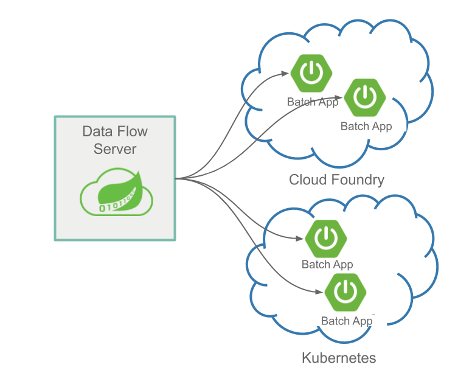

# Batch Processing

Batch processing is defined as the processing of a finite amount of data without interaction or interruption.
Applications that implement batch processing are referred to as ephemeral or short-lived apps.
An example of a batch process would be a billing application. The following image shows such an application:

This application runs nightly, to read the customer usage data from a flat file, generate pricing information for those records, and insert the billing information into a billing table.
Once all of the usage data has been read and priced and the results have been inserted into the billing table, the app stops.

That sounds pretty simple, but we have to think about what happens if the batch processing app fails four hours into a six-hour run because the database ran out of table space.
Once more table space has been added, we do not want to restart the processing from the very beginning. So the billing application needs to have the ability to restart from where it stopped.

## Spring Batch

In the previous section, we expressed the minimum requirements for our batch billing application.
However, before we start coding the restartability feature, the reader and writers, we should take a look at Spring Batch.
Spring Batch provides reusable functions that are essential in processing large volumes of records, including logging and tracing, transaction management, job processing statistics, job restart, skip, and resource management.
Spring Batch handles `Batch Job` restartability and provides a `FlatFileItemReader` and a `JdbcBatchItemWriter`, so we need not write that boilerplate code.
This way, we can focus on the business logic of pricing the usage data.

## Running Batch Apps in the Cloud

We can now see how Spring Batch can simplify our life when writing batch applications, but how can we run a batch application in the cloud?
Both Cloud Foundry and Kubernetes support the concept of running ephemeral (short-lived) apps on their platforms.
Cloud Foundry refers to ephemeral apps as tasks, and Kubernetes refers to them as jobs.
But to run an ephemeral app in the cloud, we need to have some basic features:

- Record when the application started and stopped.
- Record the exit code of the application.
- Record the exit message or the error message returned from the application.
- Have the capability to prevent an application from running if it is already running.
- Have the ability to notify other apps that the application has reached certain stages of processing.

That sounds like a lot of work, but Spring Cloud Task does all this for you and more.
Spring Cloud Task lets you develop and run short-lived microservices locally or in the cloud.
All you have to do is add the `@EnableTask` annotation.

## Orchestrating Batch apps

The following image shows how Data Flow Server can manage multiple apps in multiple clouds:

Once you have written your batch application with Spring Batch and Spring Cloud Task, how can you orchestrate the launching of the application?
This is where Spring Cloud Data Flow can help.
Spring Cloud Data Flow lets you launch a batch application through an ad-hoc request or a batch-job scheduler.
Moreover, you can launch your batch applications on the following platforms:

- Cloud Foundry
- Kubernetes
- Local server

Spring Cloud Data Flow lets you launch or schedule the launch of your batch app through the UI, a RESTful api, or the Spring Cloud Data Flow Shell.

## Next Steps

If you are interested in using the prebuilt applications to create a batch processing data pipeline,
see the [Batch Getting Started Guide](%currentPath%/batch-developer-guides/getting-started/).

If you are interested in writing and deploying your first custom batch processing application,
see the [Batch Developer Guides](%currentPath%/batch-developer-guides/batch).
