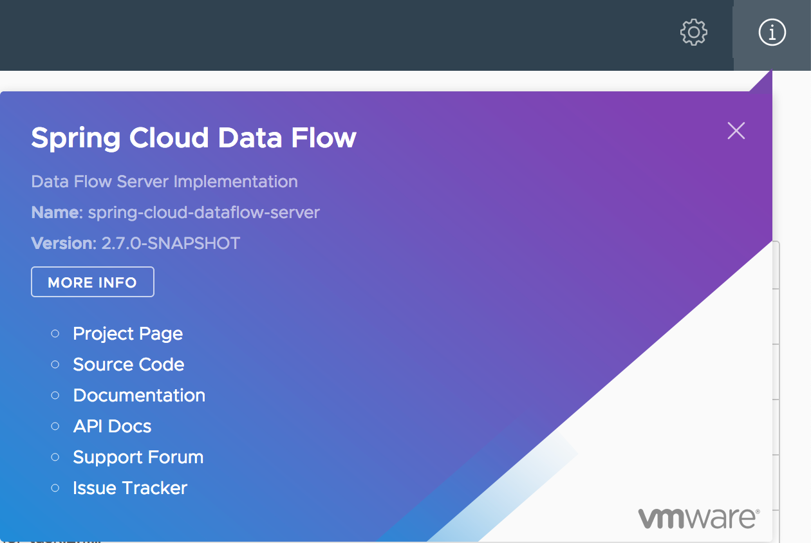
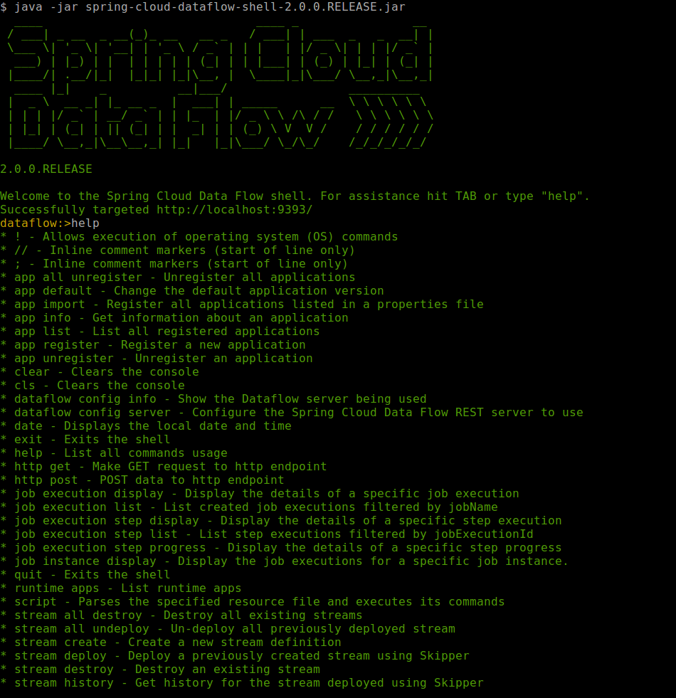

# Tooling

The dashboard and shell are the main ways to interact with Spring Cloud Data Flow.
You can also use the RESTful API by using curl or write applications that use the Java client library, which, in turn, calls the RESTful API.
This section introduces the features of the dashboard and the shell.

## Dashboard

Spring Cloud Data Flow provides a browser-based GUI, called the dashboard, that organizes the features in Data Flow in several tabs on the left hand side:

- **Apps**: Lists all registered applications and provides controls to register new applications or unregister existing applications.
- **Runtime**: Provides the list of all running applications.
- **Streams**: Lets you list, design, create, deploy, and destroy Stream Definitions.
- **Tasks**: Lets you list, create, launch, schedule, and destroy Task Definitions.
- **Jobs**: Lets you view detailed Spring Batch job history and restart a job.
- **Audit Records**: Lets you access recorded audit events.
- **About**: Provides release information for use in support calls and links to documentation and the Data Flow Shell download.

The following image shows the About tab (and the general structure of the dashboard UI);

## Shell

You can use the shell as an alternative to the dashboard to interact with Data Flow.
The shell has commands to perform most of the same tasks listed previously in the [Dashboard](#dashboard) section, the listing of audit records being the one exception.

It supports tab completion for commands and also for Stream and Batch DSL definitions. There are command-line options for connecting the shell to the Data Flow Server.

You can get a listing of commands by typing `help` and then help for each individual command by typing `help <command>`
The following image shows a partial listing of commands:

## RESTful API

Data Flow's RESTful API tries to adhere as closely as possible to standard HTTP and REST conventions in its use of HTTP verbs.
For example, `GET` is used to retrieve a resource and `POST` is used to create a new resource.  
Both the dashboard and the UI are consumers of this API.

Data Flow uses hypermedia, and resources include links to other resources in their responses. Responses are in the Hypertext Application from resource-to-resource Language - [HAL](http://stateless.co/hal_specification.html). You can find links beneath the `_links` key. Users of the API should not create URIs themselves.
Instead, they should use the links to navigate.

## Java Client

The feature guide for the [Java Client](%currentPath%/feature-guides/streams/java-dsl/) contains more information on how to programmatically interact with Data Flow.
