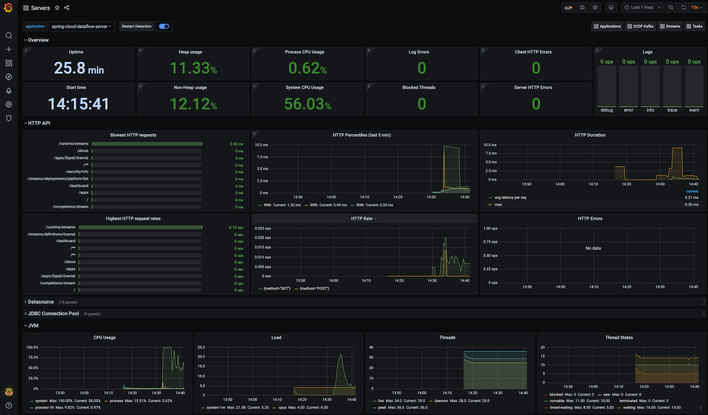

## Server Monitoring with Prometheus and Wavefront

This section describes how to monitor the Spring Cloud Data Flow and Spring Cloud Skipper Servers. The setup for each platform is different, but the general architecture is the same across all the platforms.

The Data Flow metrics architecture is designed around the [Micrometer](https://micrometer.io/) library, to provide a simple facade over the instrumentation clients for the most popular monitoring systems. See the [Micrometer documentation](https://micrometer.io/docs) for the list of supported monitoring systems.

The Data Flow and Skipper servers are pre-configured to support two of the most popular monitoring systems: [Prometheus](https://prometheus.io/) and [Wavefront](https://www.wavefront.com/). You can declaratively select which monitoring system the deployed applications uses.

To help you get started with monitoring streams, Data Flow provides [Grafana](https://grafana.com/) dashboards for Prometheus that you can install and customize for your needs. For Wavefront, you can use the Data Flow Integration tile for a rich and comprehensive metrics visualization.

<!--NOTE-->

Prometheus requires a Service Discovery component to automatically probe the configured endpoint for metrics. The Spring Cloud Data Flow server uses the [Prometheus RSocket Proxy](https://github.com/micrometer-metrics/prometheus-rsocket-proxy), which uses the `rsocket` protocol for the service-discovery mechanism. The RSocket Proxy approach is used so that we can monitor tasks, which are short lived, as well as long-lived stream applications with the same architecture. See the micrometer documentation on [short-lived task and batch applications](https://github.com/micrometer-metrics/prometheus-rsocket-proxy#support-for-short-lived-or-serverless-applications) for more information. In addition, the RSocket approach allows the same monitoring architecture to be used across all the platforms. Prometheus is configured to scrape each proxy instance. Proxies, in turn, use the RSocket connection to pull metrics from each application. The scraped metrics are then viewable through Grafana dashboards.

<!--END_NOTE-->

The following images show the Grafana and Wavefront dashboards:




### Local

This section describes how to view server metrics when you use Prometheus or InfluxDB as the metrics store on your local machine. Wavefront is a cloud offering, but you can still deploy Data Flow locally and point it to a cloud-managed Wavefront monitoring system.

<!--TABS-->

<!--Prometheus -->

#### Prometheus

To install Prometheus and Grafana, follow the [Monitoring with Prometheus and Grafana](%currentPath%/installation/local/docker-customize/#prometheus--grafana) Docker Compose instructions. Doing so brings up Spring Cloud Data Flow, Skipper, Apache Kafka, Prometheus, and prebuilt dashboards for Grafana.

Once all the containers are running, you can access the Spring Cloud Data Flow Dashboard at http://localhost:9393/dashboard

You can also reach the Prometheus UI at http://localhost:9090/graph and http://localhost:9090/targets

You can access the Grafana dashboard at http://localhost:3000 with the following credentials:

- user: `admin`
- password: `admin`

You can access the servers dashboard at the following URL: `http://localhost:3000/d/scdf-servers/servers?refresh=10s`

<!--Wavefront -->

#### Wavefront

To install Data Flow with Wavefront support, follow the [Monitoring with Wavefront](%currentPath%/installation/local/docker-customize/#wavefront) Docker Compose instructions. Doing so brings up Spring Cloud Data Flow, Skipper, and Apache Kafka. It also points to the Wavefront Data Flow Integration Tile automatically.

Wavefront is a SaaS offering, and you need to create a user account first. With that account, you can set the `WAVEFRONT_KEY` and `WAVEFRONT_URI` environment variables, as explained later.

<!--END_TABS-->

### Kubernetes

This section describes how to view application metrics for streams by using Prometheus or Wavefront as the metrics store on Kubernetes.

<!--TABS-->

<!--Prometheus -->

#### Prometheus

To install Prometheus and Grafana on Kubernetes, follow the instructions for a [kubectl based installation](%currentPath%/installation/kubernetes/kubectl/#deploy-prometheus-and-grafana).

<!--IMPORTANT-->

The address used to access the Grafana UI depends on the Kubernetes platform to which the system is deployed. If you are using (for example) GKE, the load balancer address is used. If you use Minikube (which does not provide a load balancer implementation), the IP of the Minikube (along with an assigned port) is used. In the following examples, for simplicity, we use Minikube.

<!--END_IMPORTANT-->

To obtain the URL of the Grafana UI when it is deployed to Minikube, run the following command:

```bash
$ minikube service --url grafana
http://192.168.99.100:31595
```

You can access the Grafana dashboard at http://192.168.99.100:31595 with the following credentials:

- User name: admin
- Password: password

You can access the servers dashboard at http://192.168.99.100:31595/d/scdf-servers/servers?refresh=10s

<!--Wavefront -->

#### Wavefront

Wavefront is a SaaS offering. You need to create a user account first and obtain the `API-KEY` and `WAVEFRONT-URI` assigned to your account.

Follow the general [Data Flow Kubernetes installation instructions](%currentPath%/installation/kubernetes/).

Then add the following properties to your Spring Cloud Data Flow server configuration (for example, in `src/kubernetes/server/server-config.yaml`) to enable the Wavefront Integration:

```yml
management:
  metrics:
    export:
      wavefront:
        enabled: true
        api-token: <YOUR API-KEY>
        uri: <YOUR WAVEFRONT-URI>
        source: demo-scdf-source
```

To enable Spring Cloud Skipper Wavefront monitoring, replicate the same metrics configuration to the Skipper server configuration (for example, in `src/kubernetes/skipper/skipper-config-kafka.yaml` or `src/kubernetes/skipper/skipper-config-rabbit.yaml`):

```yml
management:
  metrics:
    export:
      wavefront:
        enabled: true
        api-token: <YOUR API-KEY>
        uri: <YOUR WAVEFRONT-URI>
        source: demo-scdf-source
```

<!--END_TABS-->

### Cloud Foundry

This section describes how to view application metrics for streams by using Prometheus as the metrics store on Cloud Foundry.

<!--TABS-->

<!--Prometheus -->

#### Prometheus

To configure the Data Flow server's manifest to send metrics data from stream applications to the Prometheus RSocket gateway, follow the [Manifest-based installation instructions](%currentPath%/installation/cloudfoundry/cf-cli/#configuration-for-prometheus).

With Prometheus, Grafana, Spring Cloud Data Flow, and any other services defined in the [Getting Started - Cloud Foundry](%currentPath%/installation/cloudfoundry/cf-cli) section up and running, you are ready to collect metrics.

Depending on where you have installed Grafana, you can access the Grafana dashboard with the following credentials:

- User name: admin
- Password: password

You can access the servers dashboard at the following URL: http://localhost:3000/d/scdf-servers/servers?refresh=10s

<!--Wavefront -->

#### Wavefront

Wavefront is a SaaS offering. You need to create a user account first and obtain the `API-KEY` and `WAVEFRONT-URI` assigned to your account.

To configure the Data Flow Server to send metrics data from stream applications to the Wavefront monitoring system, follow the [Manifest-based Wavefront configuration instructions](%currentPath%/installation/cloudfoundry/cf-cli/#configuration-for-wavefront).

<!--END_TABS-->
