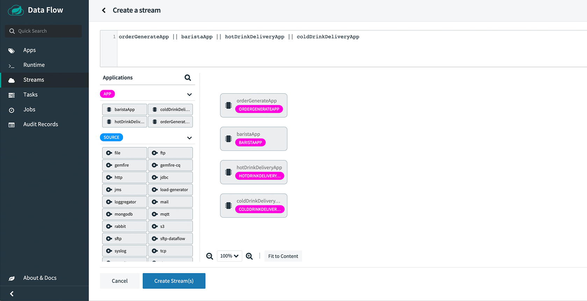

# Stream Application DSL

The Stream Pipeline DSL described in the previous section automatically sets the input and output binding properties of each Spring Cloud Stream application.
This can be done because there is only one input and/or output destination in a Spring Cloud Stream application that uses the provided binding interface of a `Source`, `Processor`, or `Sink`.
However, a Spring Cloud Stream application can define a custom binding interface such as the one shown below

```java
public interface Barista {

    @Input
    SubscribableChannel orders();

    @Output
    MessageChannel hotDrinks();

    @Output
    MessageChannel coldDrinks();
}
```

or as is common when creating a Kafka Streams application,

```java
interface KStreamKTableBinding {

    @Input
    KStream<?, ?> inputStream();

    @Input
    KTable<?, ?> inputTable();
}
```

In these cases with multiple input and output bindings, Data Flow cannot make any assumptions about the flow of data from one application to another.
Therefore the developer needs to set the binding properties to 'wire up' the application.
The _Stream Application DSL_ uses a `double pipe`, instead of the `pipe symbol`, to indicate that Data Flow should not configure the binding properties of the application. Think of `||` as meaning 'in parallel'.

For example:

`stream create --definition "orderGeneratorApp || baristaApp || hotDrinkDeliveryApp || coldDrinkDeliveryApp" --name myCafeStream`

A graphical representation of the stream woud look similar to the following:



There are four applications in this stream.
The baristaApp has two output destinations, `hotDrinks` and `coldDrinks` intended to be consumed by the `hotDrinkDeliveryApp` and `coldDrinkDeliveryApp` respectively.
When deploying this stream, you need to set the binding properties so that the `baristaApp` sends hot drink messages to the `hotDrinkDeliveryApp` destination and cold drink messages to the `coldDrinkDeliveryApp` destination.

For example:

```
app.baristaApp.spring.cloud.stream.bindings.hotDrinks.destination=hotDrinksDest
app.baristaApp.spring.cloud.stream.bindings.coldDrinks.destination=coldDrinksDest
app.hotDrinkDeliveryApp.spring.cloud.stream.bindings.input.destination=hotDrinksDest
app.coldDrinkDeliveryApp.spring.cloud.stream.bindings.input.destination=coldDrinksDest
```

Like binding properties, the rest of all the Spring Cloud Stream properties can be configured for the producers and consumers.
For example if you want to use consumer groups, you will need to set the Spring Cloud Stream application property `spring.cloud.stream.bindings.<channelName>.producer.requiredGroups` and `spring.cloud.stream.bindings.<channelName>.group` on the producer and consumer applications respectively.

Another common use case for the Stream Application DSL is to deploy a http gateway application that sends a synchronous request/reply message to a Kafka or RabbitMQ application.
In this case both the http gateway application and the Kafka or RabbitMQ application can be a Spring Integration application that does not make use of the Spring Cloud Stream library.

It is also possible to deploy just a single application using the Stream application DSL.
