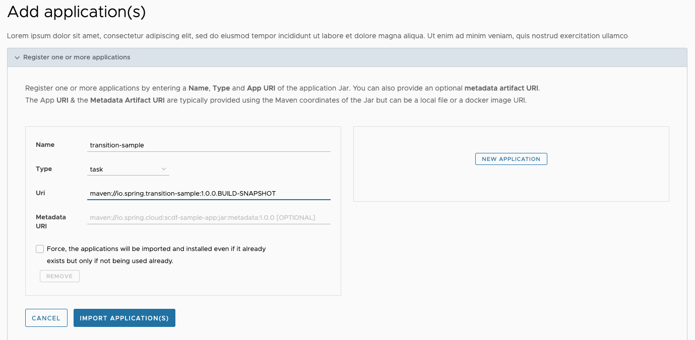
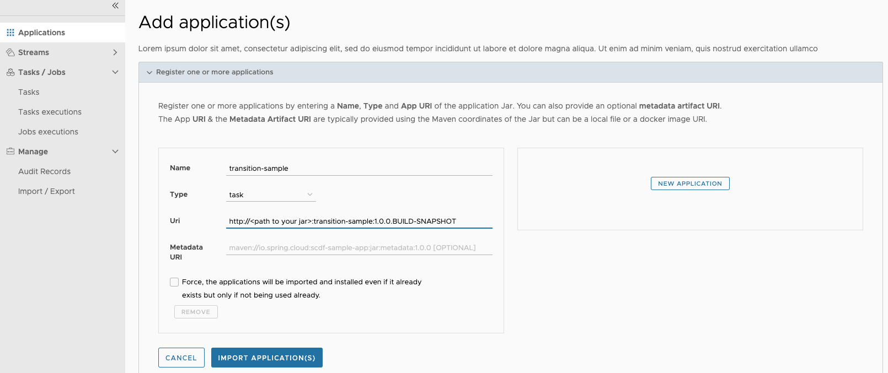
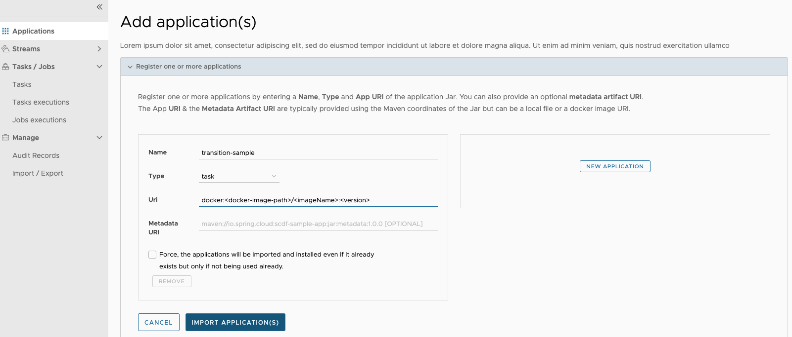
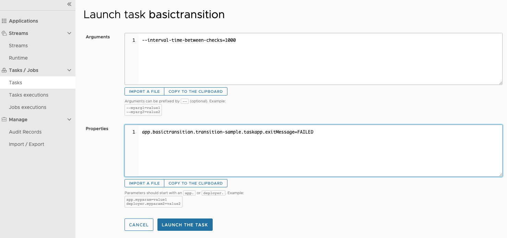
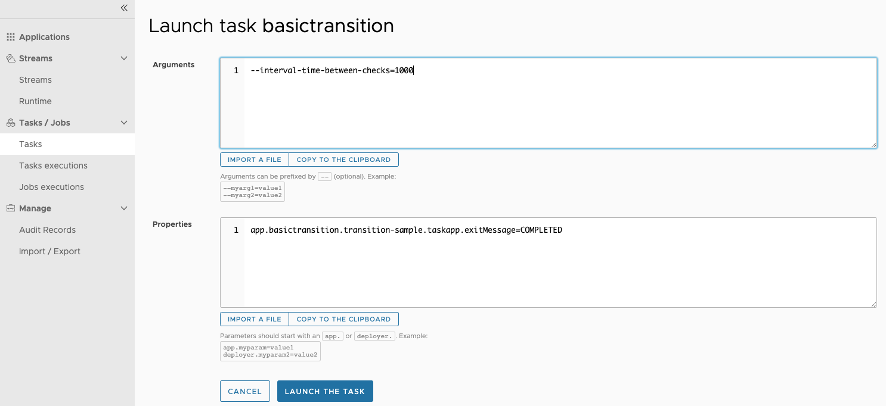
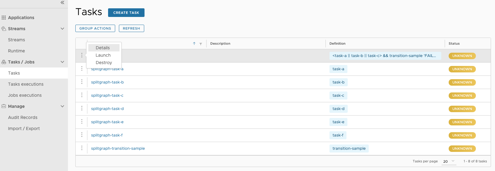
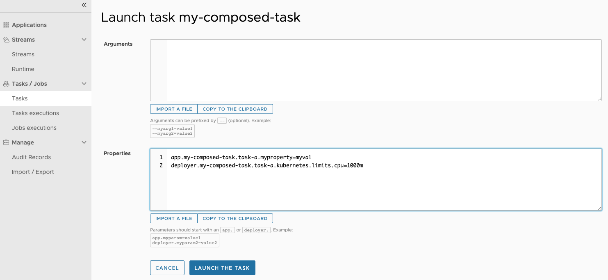

# What is a composed task?

A composed task is a directed graph where each node of the graph is a task application.
Spring Cloud Data Flow lets you create a composed task through its browser-based UI, its shell, or its RESTful API.
In this section, we show you how you can create and manage composed tasks.

## Composed Task 101

Before going into how to create and manage composed tasks, we need to discuss a scenario where we want to launch a sequence of task definitions.  
For this discussion, suppose we want to launch task definitions identified as `task-a`, `task-b`, and `task-c`.
For example, we launch `task-a`, and, if `task-a` has completed successfully, we want to launch `task-b`. Once `task-b` has completed successfully, we want to launch `task-c`. In this case, the graph would look like the following image:


The preceding diagram can be expressed by using Spring Cloud Data Flow's task definition DSL, as follows:

```
task-a && task-b && task-c
```

The `&&` in the preceding DSL states that the task definition to the left of the `&&` must complete successfully before the next task definition in the flow can be launched.

Once the preceding composed task definition is created, you can launched it in the same way you would a regular task definition. Behind the scenes, Spring Cloud Data Flow launches the `Composed Task Runner` application to manage the execution of the composed task graph.
It does this by parsing the Spring Cloud Data Flow task definition and then makes RESTful API calls back to the Spring Cloud Data Flow server to launch the task definitions. As each task completes, it launches the next task definition.
In the following sections, we show you how to create your own composed task graphs, to explore the various ways you can create a composed task flow.

# Configuring Spring Cloud Data Flow Launch Composed Tasks

As discussed earlier, the `Composed-Task-Runner` is an application that manages the execution of the tasks in a composed task graph. So, before creating composed tasks, we need to configure Spring Cloud Data Flow to launch the Composed Task Runner properly.

## Configuring Data Flow to Launch the Composed Task Runner

When launching a composed task, Spring Cloud Data Flow passes properties to the `Composed-Task-Runner` so that it can execute the directed graph properly. To do this, you must configure Spring Cloud Data Flow's `dataflow.server.uri` property so that `Composed Task Runner` can make the RESTful API calls to the correct SCDF Server:

- `dataflow.server.uri`: The URI of the Spring Cloud Data Flow Server that is used by the `Composed Task Runner` to execute its RESTful API calls. It defaults to https://localhost:9393.
- `spring.cloud.dataflow.task.composedtaskrunner.uri`: Establishes where Spring Cloud Data Flow obtains the `Composed Task Runner` artifact. By default, Spring Cloud Data Flow retrieves the artifact from Maven Central for the `local` and `Cloud Foundry` platforms. For `Kubernetes`, it obtains the artifact from DockerHub.

<!-- NOTE -->

`spring.cloud.dataflow.task.composed.task.runner.uri` has been deprecated as of Spring Cloud Data Flow 2.7.0 in favor of `spring.cloud.dataflow.task.composedtaskrunner.uri`.

<!-- END_NOTE -->

- `spring.cloud.dataflow.task.composedtaskrunner.imagePullSecret`: If running within Kubernetes and the Composed Task Runner image resides in a repository that requires authentication, you can configure a secret that contains the credentials to use when pulling the image. The property value is the name of the configured secret that must be created first. Follow the [Pull an Image from a Private Registry](https://kubernetes.io/docs/tasks/configure-pod-container/pull-image-private-registry/) guide to create the secret.
- `maximumConcurrentTasks` - Spring Cloud Data Flow lets a user limit the maximum number of concurrently running tasks for each configured platform to prevent the saturation of IaaS/hardware resources.
  The default limit is set to `20` for all supported platforms. If the number of concurrently running tasks on a platform instance is greater than or equal to the limit, the next task launch request fails, and an error message is returned through the RESTful API, the Shell, and the UI.
  You can configure this limit for a platform instance by setting the corresponding deployer property to the number maximum number of concurrent tasks:
  ```
  spring.cloud.dataflow.task.platform.<platform-type>.accounts[<account-name>].deployment.maximumConcurrentTasks`
  ```
  The `<account-name>` is the name of a configured platform account (`default` if no accounts are explicitly configured).
  The `<platform-type>` refers to one of the currently supported deployers: `local`, `cloudfoundry`, or `kubernetes`.

<!-- NOTE -->

Changing this property will require Spring Cloud Data Flow to be restarted.

<!-- END_NOTE -->

## Registering Sample Applications

Before you work with the composed task samples below, you must first register the sample applications that are used in the examples.
So, for this guide, you need to re-register the timestamp application multiple times with the following names: `task-a`, `task-b`, `task-c`, `task-d`, `task-e`, and `task-f`.

<!--TABS-->

<!--Local-->

Spring Cloud Data Flow supports Maven, HTTP, file, and Docker resources for local deployments. For local, we use the Maven resource.
The URI for a Maven artifact is generally of the form `maven://<groupId>:<artifactId>:<version>`. The Maven URI for the sample application is as follows:

```
maven://org.springframework.cloud.task.app:timestamp-task:2.1.0.RELEASE
```

The `maven:` protocol specifies a Maven artifact, which is resolved by using the remote and local Maven repositories configured for the Data Flow server.
To register an application, click the **Applications** tab on the left side of the page. Select **Add Applications** and **Register one or more applications**. For `task-a` fill in the form, as shown in the following image, and click **Register the application(s)**.


Repeat this registration for `task-a`, `task-b`, `task-c`, `task-d`, `task-e`, and `task-f` while using the same URI: `maven://org.springframework.cloud.task.app:timestamp-task:2.1.0.RELEASE`.

<!--CloudFoundry-->

Spring Cloud Data Flow supports Maven, HTTP, and Docker resources for local deployments. For Cloud Foundry, we use an HTTP (actually, HTTPS) resource. The URI for an HTTPS resource is of the form `https://<web-path>/<artifactName>-<version>.jar`. Spring Cloud Data Flow then pulls the artifact from the HTTPS URI.

The HTTPS URI for the sample application is as follows:

```
https://repo.spring.io/libs-snapshot/org/springframework/cloud/task/app/timestamp-task/2.1.0.RELEASE/timestamp-task-2.1.0.RELEASE.jar
```

To register an application, click the **Applications** tab on the left side of the page. Select **Add Applications** and **Register one or more applications**. Fill in the form, as shown in the following image, and click **Register the application(s)**.


Repeat this registration for `task-a`, `task-b`, `task-c`, `task-d`, `task-e`, and `task-f` while using the same URI:

```
https://repo.spring.io/libs-snapshot/org/springframework/cloud/task/app/timestamp-task/2.1.0.RELEASE/timestamp-task-2.1.0.RELEASE.jar`
```

<!--Kubernetes-->

Spring Cloud Data Flow supports Docker resources for Kubernetes deployments.
The URI for a Docker image is the form `docker:<docker-image-path>/<imageName>:<version>` and is resolved by using the Docker registry configured for the Data Flow task platform and image pull policy.

The Docker URI for the sample app is as follows:

```
docker:springcloudtask/timestamp-task:2.1.0.RELEASE
```

To register an application, click the **Applications** tab on the left side of the page. Select **Add Applications** and **Register one or more applications**. Fill in the form, as shown in the following image, and click **Register the application(s)**.


Repeat this registration for `task-a`, `task-b`, `task-c`, `task-d`, `task-e`, and `task-f` while using the same URI: `docker:springcloudtask/timestamp-task:2.1.0.RELEASE`.

<!--END_TABS-->

<!-- NOTE -->

If Maven Central or DockerHub cannot be reached for a given Spring Cloud Data Flow
deployment a different URI can be specified to retrieve the Composed Task Runner using the
`spring.cloud.dataflow.task.composed.task.runner.uri` property.

<!-- END_NOTE -->

## The Transition Sample Project

To explore some of the flows that are available through a composed task diagram, we need an application
that lets us configure its exit status at startup time. This `transition-sample` gives us the ability to explore various flows through a composed task diagram.

### Getting the Transition Sample Project from Github

We need to pull the project from Github:

1. Open a terminal session.
1. Choose a working directory where you want to clone the project.
1. From the working directory, run the following git command:
   ```
   git clone https://github.com/spring-cloud/spring-cloud-dataflow-samples.git
   ```
1. Go into the spring-cloud-dataflow-samples/transition-sample directory
   ```
   cd spring-cloud-dataflow-samples/transition-sample
   ```

### Building the Transition Sample Project

To build the application, use the following command:

```
./mvnw clean install
```

To build the Docker image, use the following command:

```
./mvnw dockerfile:build
```

### Registering the Transition Sample

<!--TABS-->

<!--Local-->

For local deployments, Spring Cloud Data Flow supports Maven, HTTP, file, and Docker resources. For this example, we use the Maven resource.
The URI for a Maven artifact is generally of the form `maven://<groupId>:<artifactId>:<version>`. The Maven URI for the sample application is as follows:

```
maven://io.spring:transition-sample:1.0.0.BUILD-SNAPSHOT
```

The `maven:` protocol specifies a Maven artifact, which is resolved by using the remote and local Maven repositories configured for the Data Flow server.
To register an application, click the **Applications** tab on the left side of the page. Select **Add Applications** and **Register one or more applications**. Fill in the form, as shown in the following image, and click **Register the application(s)**.



<!--CloudFoundry-->

Spring Cloud Data Flow supports Maven, HTTP, and Docker resources for local deployments. For this example, we use an HTTP (actually, HTTPS) resource. The URI for an HTTPS resource is of the form `https://<web-path>/<artifactName>-<version>.jar`. Spring Cloud Data Flow then pulls the artifact from the HTTPS URI.

The HTTPS URI for the sample app is as follows:

```
http://<path to your jar>:transition-sample:1.0.0.BUILD-SNAPSHOT
```

To register an application, click the **Applications** tab on the left side of the page. Select **Add Applications** and **Register one or more applications**. Fill in the form, as shown in the following image, and click **Register the application(s)**.



<!--Kubernetes-->

Spring Cloud Data Flow supports Docker resources for Kubernetes deployments.
The URI for a Docker image is of the form `docker:<docker-image-path>/<imageName>:<version>` and is resolved by using the Docker registry configured for the Data Flow task platform and image pull policy.

The Docker URI for the sample app is as follows:

```
docker:springcloud/transition-sample:latest
```

To register an application, click the **Applications** tab on the left side of the page. Select **Add Applications** and **Register one or more applications**. Fill in the form, as shown in the following image, and click **Register the application(s)**.



<!--END_TABS-->

#Building a Composed Task
This section explores the three foundation structures supported by Spring Cloud Data Flow:

- Conditional Execution
- Transitional Execution
- Split Execution

## Conditional Execution

Conditional execution is expressed by using a double ampersand symbol `&&`. This lets each task in the sequence be launched only if the previous task successfully completed.

### Create Conditional Execution Composed Task Definition

To create your conditional execution by using the Spring Cloud Data Flow UI, click the **Tasks** tab on the left hand side of the dashboard and then press the **CREATE TASK** button at the top of the page.
Now copy the following expression and paste it in the text box located at the top of the page:

```
task-a && task-b
```

You can see the graph appear in the dashboard, as the following image shows:


<!-- NOTE -->

In the preceding example, note that we used `timestamp-1` and `timestamp-2` labels. This is necessary because we use two timestamp applications in the same graph.

<!-- END_NOTE -->

Now press the `Create Task` button at the bottom of the page. A dialog asks you to **Confirm Task Creation**. To do so, enter `conditional-execution` as the composed task name in the `Name` field and click the **Create the task** button, as the following image shows:


Now the Task Definition page is displayed, and you can see that three task definitions were created, as the following image shows:


1. The `conditional-execution` task definition is the `Composed-Task-Runner` application that manages the execution of the directed-graph.
1. The `conditional-execution-timestamp-1` is the task definition that represents the `timestamp-1` app defined in the DSL you entered earlier.
1. The `conditional-execution-timestamp-2` is the task definition that represents the `timestamp-2` app defined in the DSL you entered earlier.

### Launch Conditional Execution Composed Task Definition

To launch the composed task, click the dropdown icon to the left of the task definition named `conditional-execution` and select the **Launch** option, as the following image shows:

Now the task launch page appears. Since we are using app defaults, we merely need to press the **Launch the task** button, as the following image shows:

When the composed task called `conditional-execution` is launched, it launches the task called `conditional-execution-task-a`, and, if it completes successfully, the task called `conditional-execution-task-b` is launched. If `conditional-execution-task-a` fails, `conditional-execution-task-b` does not launch.

### Check the Status of the Conditional Execution Composed Task Definition

Now that we have executed the `conditional-execution` task definition, we can check the task execution status.
To do so, click the **Executions** tab on top of the **Tasks** page. From here, we can see that the `conditional-execution` (`Composed-Task-Runner`) successfully launched each of the child apps (`conditional-execution-task-a` and `conditional-execution-task-b`), as the following image shows:


## Transitional Execution

Transitions let you specify the branch of a tree you want the flow to follow. A task transition is represented by the following symbol `->`. To demonstrate, we create a basic transition graph.

### Create Basic Transition Task Definition

To create a basic transition by using the Spring Cloud Data Flow UI, click the **Tasks** tab on the left side of the dashboard and then press the **CREATE TASK** button at the top of the page.
Now copy the following expression and paste it in the text box located at the top of the page:

```
transition-sample 'FAILED' -> task-a 'COMPLETED' -> task-b
```

It should look like the following:


<!-- NOTE -->

You can use Spring Cloud Data Flow UI's drag and drop capabilities to draw the graph vs. using the DSL.

<!-- END_NOTE -->

Now that the graph is rendered, we can dig into the details.
The first application to be launched is `transition-sample`. Since `transition-sample` is a Spring Cloud Task application, Spring Cloud Task records the exit message to the database at the end of the execution. This message will have one of the following values:

- `COMPLETED`: The task completed successfully.
- `FAILED`: The task failed during its execution.
- A custom exit message: A Spring Cloud Task application can return a custom exit message, as discussed in the [Spring Cloud Task documentation](https://docs.spring.io/spring-cloud-task/docs/current/reference/index.html#features-task-execution-listener-exit-messages).

Once the `transition-sample` application's execution is complete, the composed task runner checks the exit message for `transition-sample` and then evaluates which of the paths it should take. In our case, its has two paths (as denoted by the `->` operator).

- `FAILED`: If `transition-sample` returns `FAILED`, the `timestamp` app labeled `timestamp-1` is executed.
- `COMPLETED`: If `transition-sample` returns `COMPLETED`, the `timestamp` app labeled `timestamp-2` is executed.

Now press the **Create Task** button at the bottom of the page. Now a dialog asks you to **Confirm Task Creation**. To do so, enter `basictransition` as the composed task name in the `Name` field and click the **Create the task** button, as the following image shows:


### Launch the Composed Task Definition

Now we can launch our composed task a couple of times so that we can exercise its paths through the tree.

First, we can see what happens if we set the exit message to `FAILED`.
To do so, select the `basictransition` `Composed Task Runner` to be executed, as the following image shows:

Now, from the task launch page, populate the page with the following:

Arguments:

```
--interval-time-between-checks=1000
```

Parameters:

```
app.basictransition.transition-sample.taskapp.exitMessage=FAILED
```

It should look like the following image:


Now that it has been executed, we can verify that the `FAILED` path was actually followed. We can do so by clicking the **Task executions** tab on the left side of the task page:


Doing so shows us that the `Composed Task Runner` controlling the composed task execution basic-transition was launched and that `transition-sample` was launched. From there, the `FAILED` branch was executed, as denoted by `basictransition-timestamp-1 was launched`.

Now relaunch the `Composed Task Runner` and set the `taskapp.exitMessage` to `COMPLETED` to exercise the other branch. To do so, select the `basictransition` to be executed, as the following image shows:

Now, in the task launch page, we can populate the page with the following:

Arguments:

```
--interval-time-between-checks=1000
```

Parameters:

```
app.basictransition.transition-sample.taskapp.exitMessage=COMPLETED
```

It should look like the following:



Now that it has been executed, we can verify that the `COMPLETED` path was followed. You can do so by pressing the `Task executions` tab on the left side of the page:


####Task Arguments and Parameters

Wait a minute…​ What is all that stuff I put in the command line? So for in this example, we wanted to show how to use both command line args and properties. We used the arguments to establish the properties for the `Composed Task Runner`:

1. `--interval-time-between-checks=1000` states that the `Composed Task Runner` waits one second between checks to make sure that a task is complete (the default is ten seconds).

You can read about the sections of a property and the different property types in the [passing properties section](#passing-properties).

#### Are There More States to a Transition?

Now what happens if I were to enter `FOO` for the exit message?

To do so, select the `basictransition` `Composed Task Runner` to be executed, as the following image shows:

From the task launch page, populate the page with the following:

Arguments:

```
--interval-time-between-checks=1000
```

Parameters:

```
app.basictransition.transition-sample.taskapp.exitMessage=FOO
```

It should look like the following:


Now that it has been executed, we can verify that path `FOO` was actually followed. To do so, click the **Task executions** tab on the left side of the page:


In this case, we see that the composed task ended with merely running the `Composed Task Runner` and the transition sample. This was because `FOO` was not targeted. How would we handle that -- that is, have a path for `COMPLETED`, `FAILED`, and everything else?

In this case, we would want to create another composed task by using a wild card.

To create your basic transition by using the Spring Cloud Data Flow UI, click the **Tasks** tab on the left side of the dashboard and then press the **CREATE TASK** button at the top of the page.
Now copy the following expression and paste it in the text box at the top of the page:

```
transition-sample 'FAILED' -> task-a 'COMPLETED' -> task-b '*' -> task-c
```

It should look like the following:

Now press the **Create Task** button at the bottom of the page. Now a dialog asks you to **Confirm Task Creation**. To do so, enter `anothertransition` as the composed task name in the `Name` field and click the **Create the task** button, as the following image shows:


To do so, select the `anothertransition` `Composed Task Runner` to be executed, as the following image shows:

From the task launch page, populate the page with the following:

Arguments:

```
--increment-instance-enabled=true
--interval-time-between-checks=1000
```

Parameters:

```
app.anothertransition.transition-sample.taskapp.exitMessage=FOO
```

It should look like the following:


Launch the task and then verify that path `FOO` was actually followed. To do so, click the **Executions** tab at the top of the task page:


In this case, we see that the wildcard catches all other exit messages. We can verify by seeing that `anothertransition-timestamp-3` was launched.

## Split Execution

What if we want to execute multiple tasks at the same time? The Composed Task DSL supports the concept of a split, to let you do just that. The task definition DSL supports a concept of a split that lets you launch multiple task apps at the same time. Each split contains a list of tasks that are contained within the less than `<` and greater than `>` symbol and delimited by twp pipe symbols (`||`).  
For example, if we wanted to launch three tasks at the same time, the DSL would look like:

```
<task-a || task-b || task-c>
```

Now we can create a composed task that contains both a split and a transition, to show the possibilities.
To create your split graph sample by using the Spring Cloud Data Flow UI, click the **Tasks** tab on the left-hand side of the dashboard and then click the **CREATE TASK** button at the top of the page.
Now copy the expression below and paste it in the text box at the top of the page:

```
<task-a || task-b || task-c>  && transition-sample 'FAILED' -> task-d 'COMPLETED' -> task-e '*' -> task-f
```

It should look like the following:

Now click the **Create Task** button at the bottom of the page. Now a dialog asks you to **Confirm Task Creation**. To do so, enter `splitgraph` as the composed task name in the `Name` field and press the **Create the task** button, as the following image shows:


Select the `splitgraph` `Composed Task Runner` to be executed, as the following image shows:

From the task launch page, populate the following fields:

Arguments:

```
--interval-time-between-checks=1000
--split-thread-core-pool-size=4
--spring.cloud.task.closecontext-enabled=true
```

Parameters:

```
app.splitgraph.transition-sample.taskapp.exitMessage=FOO
```

It should look like the following:


Launch the task and then verify that all tasks were launched and that the path `FOO` was actually followed. To do so, click the **Task executions** tab on the left side of the task page:


In this example, we see that `splitgraph-task-a`, `splitgraph-task-b`, and `splitgraph-task-b` were fired simultaneously before CTR launched our transition app. We also added a new argument: `--split-thread-core-pool-size=4`. It basically states that the composed task runner can run four apps simultaneously.

### Arguments and Properties

Again, what is all that stuff I put in the command line? So, for this example we wanted to show how to use both command line arguments and properties. We used the arguments to establish the properties for the `Composed Task Runner`:

1. `--interval-time-between-checks=1000` states that the `Composed Task Runner` will wait one second between checks to make sure that a task is complete (the default is 10 seconds).
1. `--split-thread-core-pool-size=4` states that we want up to four simultaneous tasks to run at the same time.
1. `--spring.cloud.task.closecontext-enabled=true` states that we want the Spring context to close when the `Composed Task Runner`.

<!-- NOTE -->

When using `split` you must set the `spring.cloud.task.closecontext-enabled` property as shown above.

<!-- END_NOTE -->

### Configuring Your Split

In the example shown in the preceding section, we configured the behavior of our split in the composed task by using the `spring.cloud.task.closecontext-enabled` and `split-thread-core-pool-size` properties. You can also use the following properties when you use splits:

- `spring.cloud.task.closecontext-enabled`: When using splits, this property is required to be set to `true` because, otherwise, the context does not close (because threads were allocated to support the split).
- `split-thread-core-pool-size`: Establishes the initial number of threads required for the splits in the composed task. Each task app contained in a split requires a thread in order to execute. (Defaults to 1)
- `split-thread-max-pool-size`: The maximum number threads to be allocated.
- `split-thread-queue-capacity`: The number of tasks that should be enqueued if all threads are in use before a new thread is allocated.

### Basic Split Sizing

The simplest configuration for splits is to set the `split-thread-core-pool-size` property. You want to look at your graph and count the split that has the largest number of task apps.
This is the number of threads you need. To set the thread count, use the `split-thread-core-pool-size` property (defaults to 1).
So, for example, a definition like: `<AAA || BBB || CCC> && <DDD || EEE>` would require a split-thread-core-pool-size of 3.
This is because the largest split contains three task apps. A count of 2 would mean that AAA and BBB would run in parallel, but CCC would wait until either AAA or BBB finished. Then DDD and EEE would run in parallel.

## Restarting Composed Task Runner when task app fails

Composed tasks in Spring Cloud Data Flow let you re-launch the failed composed task in cases where a task app fails.
A task app is considered failed when the application returns a non-zero `exitCode`. In the following example, we have a simple conditional execution composed task:

```
task-a && task-b && task-c
```

Assume we have created a composed task named `my-composed-task` and that we now want to launch it by using the UI:

1. Launch it by pressing the `play` button, as the following image shows:
   
1. When the launch page appears press the `Launch the task` button.
1. Once `my-composed-task` has completed executing, we can see that `task-b` was marked `ERROR`, meaning the application returned a non-zero `exitCode`. We can verify this by clicking the **Executions** tab at the top of the page and viewing the task executions. Note that `my-composed-task-task-b` has been marked with an exit code of `1`. This means that this task app returned a non-zero exit code, which stopped the composed task execution.  
    
   Once we have resolved the problem that caused the failure, we can restart `my-composed-task` and the composed task runner identifies the task app that failed and re-runs it and then continues executing the DSL from that point.

1. Press the `Jobs` tab located on the left side of the page.
1. Now press the dropdown button by the failed `my-composed-task` and select **Restart the job**, as the following image shows:
   
1. Once the composed task completes, we see a new job for `my-composed-task` that shows a status of `COMPLETED`.
   
1. Now click the **Tasks** tab to the left of the page and, when the Task Definition page appears, click the **Executions** tab at the top. Notice that you have two `Composed Task Runs`. The first is the failed composed task execution where `task-b` failed. Then, on the second execution, we see that `my-composed-task` `Composed Task Runner` started the graph at the failed task app (`task-b`) and completed the composed task, as the following image shows:
   

# Passing Properties

Spring Cloud Data Flow lets you pass both application and deployment properties to `Composed Task Runner` and to the task apps in the graph.

## Passing Properties to Tasks in the Graph

You can set properties for a task in the graph in two ways:

- Setting the property in the task definition.
- Setting the property at composed task launch time.

### Setting property in the task definition

You can set a property when writing a composed task definition. You can do so by adding adding the `--` token followed by the property to the right of the task application name in the composed task definition. The following example shows how to do so:

```
task-a --myproperty=value1 --anotherproperty=value2 && task-b --mybproperty=value3
```

In the preceding example, `task-a` has two properties set, and `task-b` has a single property set.

### Setting Property at Composed Task Launch Time

Four components make up the property:

- Property Type: Tells Spring Cloud Data Flow whether the property is either a `deployment` or an `app` type.
  - Deployment properties: Instructions to the deployer responsible for deploying the task app.
  - App properties: Properties passed directly the task app.
- Composed Task Definition Name
- Task App Name: The label or the name of the application to which the property should be applied.
- Property Key: The key of the property that is to be set.

The following example sets a `myproperty` property for a task app named `task-a` in a composed task named `my-composed-task` for the following dsl:

```
task-a && task-b
```

It would look something like the following:


Similarly if we want to pass a deployer property, the format would remain the same except that the property type would `deployer`. For example, we need to set the `kubernetes.limits.cpu` for `task-a`:

```
    deployer.my-composed-task.task-a.kubernetes.limits.cpu=1000m
```

Launching a composed task and setting both `app` and `deployer` properties would be done in the following way by using the UI:

1. Launch the composed task, as the following image shows, by pressing the Play button next to the composed task definition that needs to be launched:
   
1. Set the properties as follows in the `Parameters` text box:
   
1. Now press the **Launch the task** button.

<!-- NOTE -->

Properties set at launch time have a higher precedence than those set at task definition. For example, if property `myproperty` has been set in the composed task definition and at launch time, the value set at launch time will be used.

<!-- END_NOTE -->

## Passing Properties to Composed Task Runner

Three components make up the property:

- Property Type: Tells Spring Cloud Data Flow whether the property is either a `deployment` or a `app` type.
  - Deployment properties: Instructions to the deployer responsible for deploying the task app.
  - App properties: Properties passed directly to the task app.
- Composed Task Application Name: Unlike when passing properties to a task app where we used the composed task definition name, we use the name of the composed task runner app.
- Property Key: The key of the property that is to be set.

We can launch a composed task in which we want to pass the following properties to the `Composed Task Runner`:

- `increment-instance-enabled`: An `app` property that lets a single `Composed Task Runner` instance be re-executed without changing the parameters.
- `kubernetes.limits.cpu`: A `deployer` property that sets the Kubernetes CPU limit for the composed task runner.
  Launching a composed task and setting both `app` and `deployer` properties for the `Composed Task Runner` is done in the following way by using the UI:

1. Launch a composed task, as the following image shows, by pressing the `play` button next to the composed task definition that needs to be launched:
   
1. Set the properties in the `Parameters` text box, as the following image shows:
   
1. Press the **Launch the task** button.

## Launching Composed Task using RESTful API

In this section, we provide an example of how to create and launch a composed-task.

For this example, we want to create a composed task `my-composed-task` with the following composed task definition:

```
task-a && task-b
```

Using `curl`, the command would look like:

```shell script
curl 'http://localhost:9393/tasks/definitions' --data-urlencode "name=my-composed-task" --data-urlencode "definition=task-a && task-b"
```

The response from the Spring Cloud Data Flow Server looks something like:

```http request
HTTP/1.1 200
Content-Type: application/hal+json
Transfer-Encoding: chunked
Date: Fri, 17 Jan 2020 16:19:04 GMT

{"name":"my-composed-task","dslText":"task-a && task-b","description":"","composed":true,"lastTaskExecution":null,"status":"UNKNOWN","_links":{"self":{"href":"http://localhost:9393/tasks/definitions/my-composed-task"}}}
```

To verify that the `my-composed-task` composed task, was created we can execute a curl list:

```shell script
curl 'http://localhost:9393/tasks/definitions?page=0&size=10&sort=taskName' -i -X GET
```

The response from the Spring Cloud Data Flow Server looks something like:

```http request
HTTP/1.1 200
Content-Type: application/hal+json
Transfer-Encoding: chunked
Date: Fri, 17 Jan 2020 16:24:39 GMT

{"_embedded":{"taskDefinitionResourceList":[{"name":"my-composed-task","dslText":"task-a && task-b","description":"","composed":true,"lastTaskExecution":null,"status":"UNKNOWN","_links":{"self":{"href":"http://localhost:9393/tasks/definitions/my-composed-task"}}},{"name":"my-composed-task-task-a","dslText":"task-a","description":null,"composed":false,"lastTaskExecution":null,"status":"UNKNOWN","_links":{"self":{"href":"http://localhost:9393/tasks/definitions/my-composed-task-task-a"}}},{"name":"my-composed-task-task-b","dslText":"task-b","description":null,"composed":false,"lastTaskExecution":null,"status":"UNKNOWN","_links":{"self":{"href":"http://localhost:9393/tasks/definitions/my-composed-task-task-b"}}}]},"_links":{"self":{"href":"http://localhost:9393/tasks/definitions?page=0&size=10&sort=taskName,asc"}},"page":{"size":10,"totalElements":3,"totalPages":1,"number":0}}
```

We can launch `my-composed-task` with the following properties for task-a:

- `app.my-composed-task.task-a.my-prop=good`
- `app.my-composed-task.task-b.my-prop=great`

Run the following curl command to launch the task:

```shell script
curl 'http://localhost:9393/tasks/executions' -i -X POST -d 'name=my-composed-task&properties=app.my-composed-task.task-a.my-prop=good,%20app.my-composed-task.task-b.my-prop=great'
```

The response from the Spring Cloud Data Flow Server looks something like:

```http request
HTTP/1.1 201
Content-Type: application/json
Transfer-Encoding: chunked
Date: Fri, 17 Jan 2020 16:33:06 GMT
```

To verify that the `my-composed-task` composed task was executed, we can execute a curl list:

```shell script
curl 'http://localhost:9393/tasks/executions?page=0&size=10' -i -X GET
```

The response from the Spring Cloud Data Flow Server looks something like:

````http request
HTTP/1.1 200
Content-Type: application/hal+json
Transfer-Encoding: chunked
Date: Fri, 17 Jan 2020 16:35:42 GMT

{"_embedded":{"taskExecutionResourceList":[{"executionId":285,"exitCode":0,"taskName":"my-composed-task-task-b","startTime":"2020-01-17T11:33:24.000-0500","endTime":"2020-01-17T11:33:25.000-0500","exitMessage":null,"arguments":["--spring.cloud.task.parent-execution-id=283","--spring.cloud.data.flow.platformname=default","--spring.cloud.task.executionid=285"],"jobExecutionIds":[],"errorMessage":null,"externalExecutionId":"my-composed-task-task-b-217b8de4-8877-4350-8cc7-001a4347d3b5","parentExecutionId":283,"resourceUrl":"URL [file:////Users/glennrenfro/project/spring-cloud-dataflow-samples/pauseasec/target/pauseasec-1.0.0.BUILD-SNAPSHOT.jar]","appProperties":{"spring.datasource.username":"******","my-prop":"great","spring.datasource.url":"******","spring.datasource.driverClassName":"org.mariadb.jdbc.Driver","spring.cloud.task.name":"my-composed-task-task-b","spring.datasource.password":"******"},"deploymentProperties":{"app.task-b.my-prop":"great"},"taskExecutionStatus":"COMPLETE","_links":{"self":{"href":"http://localhost:9393/tasks/executions/285"}}},{"executionId":284,"exitCode":0,"taskName":"my-composed-task-task-a","startTime":"2020-01-17T11:33:15.000-0500","endTime":"2020-01-17T11:33:15.000-0500","exitMessage":null,"arguments":["--spring.cloud.task.parent-execution-id=283","--spring.cloud.data.flow.platformname=default","--spring.cloud.task.executionid=284"],"jobExecutionIds":[],"errorMessage":null,"externalExecutionId":"my-composed-task-task-a-0806d01f-b08a-4db5-a4d2-ab819e9df5df","parentExecutionId":283,"resourceUrl":"org.springframework.cloud.task.app:timestamp-task:jar:2.1.0.RELEASE","appProperties":{"spring.datasource.username":"******","my-prop":"good","spring.datasource.url":"******","spring.datasource.driverClassName":"org.mariadb.jdbc.Driver","spring.cloud.task.name":"my-composed-task-task-a","spring.datasource.password":"******"},"deploymentProperties":{"app.task-a.my-prop":"good"},"taskExecutionStatus":"COMPLETE","_links":{"self":{"href":"http://localhost:9393/tasks/executions/284"}}},{"executionId":283,"exitCode":0,"taskName":"my-composed-task","startTime":"2020-01-17T11:33:12.000-0500","endTime":"2020-01-17T11:33:33.000-0500","exitMessage":null,"arguments":["--spring.cloud.data.flow.platformname=default","--spring.cloud.task.executionid=283","--spring.cloud.data.flow.taskappname=composed-task-runner"],"jobExecutionIds":[75],"errorMessage":null,"externalExecutionId":"my-composed-task-7a2ad551-a81c-46bf-9661-f9d5f78b27c4","parentExecutionId":null,"resourceUrl":"URL [file:////Users/glennrenfro/project/spring-cloud-task-app-starters/composed-task-runner/apps/composedtaskrunner-task/target/composedtaskrunner-task-2.1.3.BUILD-SNAPSHOT.jar]","appProperties":{"spring.datasource.username":"******","spring.datasource.url":"******","spring.datasource.driverClassName":"org.mariadb.jdbc.Driver","spring.cloud.task.name":"my-composed-task","composed-task-properties":"app.my-composed-task-task-a.app.task-a.my-prop=good, app.my-composed-task-task-b.app.task-b.my-prop=great","graph":"my-composed-task-task-a && my-composed-task-task-b","spring.datasource.password":"******"},"deploymentProperties":{"app.composed-task-runner.composed-task-properties":"app.my-composed-task-task-a.app.task-a.my-prop=good, app.my-composed-task-task-b.app.task-b.my-prop=great"},"taskExecutionStatus":"COMPLETE","_links":{"self":{"href":"http://localhost:9393/tasks/executions/283"}}}]},"_links":{"self":{"href":"http://localhost:9393/tasks/executions?page=0&size=10"}},"page":{"size":10,"totalElements":3,"totalPages":1,"number":0}}```
````

# Configuring Composed Task Runner

This section describes how to configure a composed task runner.

## Launching a Composed Task When Security is Enabled

As a user, you have three options for how to launch a composed task when Spring Cloud Data Flow authentication is enabled:

- Basic authentication: Authentication using username and password.
- User-configured access token: When launching a composed task, provide the token you wish to use at launch time by setting the `dataflow-server-access-token` property.
- Data Flow-provided user token: If the `dataflow-server-use-user-access-token` property is set to `true`, Spring Cloud Data Flow auto-populates the `dataflow-server-access-token` property with the access token of the current logged in user.

### Basic Authentication

This example launches a composed task where the user provides the username and password. To do so:

1. Launch a composed task, as the following image shows, by pressing the `play` button next to the composed task definition to launch:
   
1. Set the `dataflow-server-username` and `dataflow-server-password`, as the following image shows, in the `Parameters` text box:
   
1. Click the **Launch the task** button to launch the composed task.

### Using Your Own Access Token

If the composed task needs to be launched with a specific access token, pass the token by using the `dataflow-server-access-token` property. To do so:

1. Launch a composed task, as the following image shows, by pressing the `play` button next to the composed task definition to launch:
   
1. Set the `dataflow-server-access-token`, as the following image shows, in the `Parameters` text box:
   
1. Click the **Launch the task** button to launch the composed task.

### User Access Token

In this example, we will launch a composed task where the `dataflow-server-use-user-access-token` is set to `true`. To do so:

1. Launch a composed task, as the following image shows, by pressing the `play` button next to the composed task definition to launch:
   
1. Set the `dataflow-server-use-user-access-token`, as the following image shows, in the `Arguments` text box:
   
1. Click the **Launch the task** button to launch the composed task.

## Configure the URI for Composed Tasks

When you launch a composed task, Spring Cloud Data Flow launches the `Composed Task Runner`
application to manage the execution of the composed task graph.
It does so by parsing the Spring Cloud Data Flow task definitions
and then makes RESTful API calls back to the Spring Cloud Data Flow server to
launch the task definitions. As each task completes, it launches the next
task definition. To set the URI that `Composed Task Runner`
uses to make RESTful API calls, you need to set the `SPRING_CLOUD_DATAFLOW_SERVER_URI`
property in Spring Cloud Data Flow server. The next two listings show how to do so:

- Kubernetes specification for Spring Cloud Data Flow Server

```yaml
apiVersion: apps/v1
kind: Deployment
metadata:
  ...
spec:
  ...
  template:
    ...
    spec:
      containers:
        env:
        ...
        - name: SPRING_CLOUD_DATAFLOW_SERVER_URI
          value: '<URI to your SCDF Server>'
        ...
```

- Cloud Foundry Manifest for Spring Cloud Data Flow Server

```yaml
---
applications:
  ...
  env:
    ...
    SPRING_CLOUD_DATAFLOW_SERVER_URI: <URI to your SCDF Server>
  services:
    ...
```
