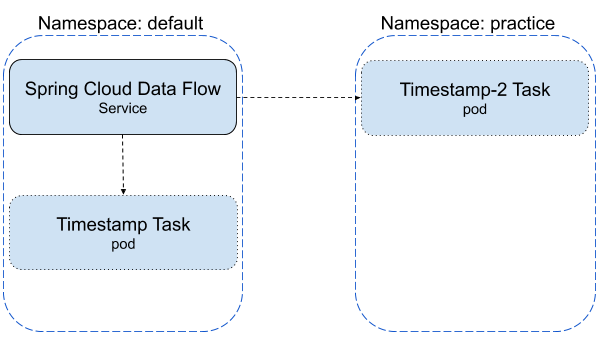
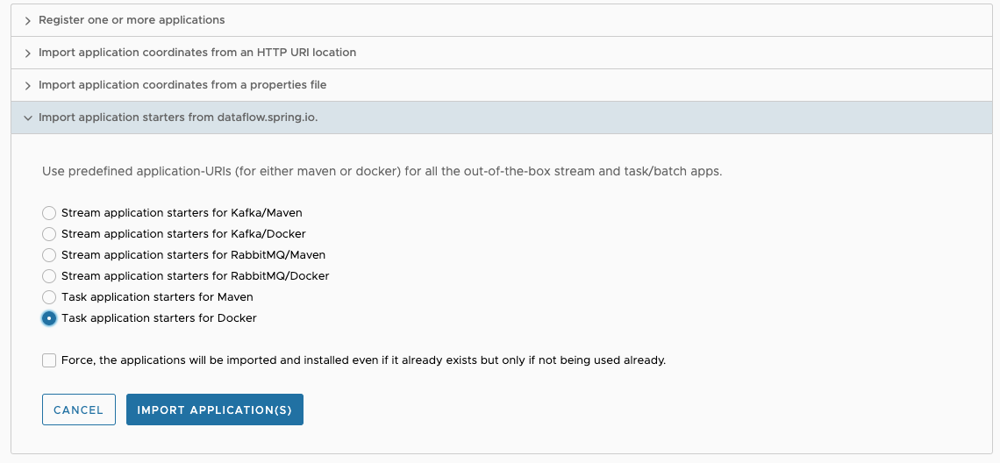
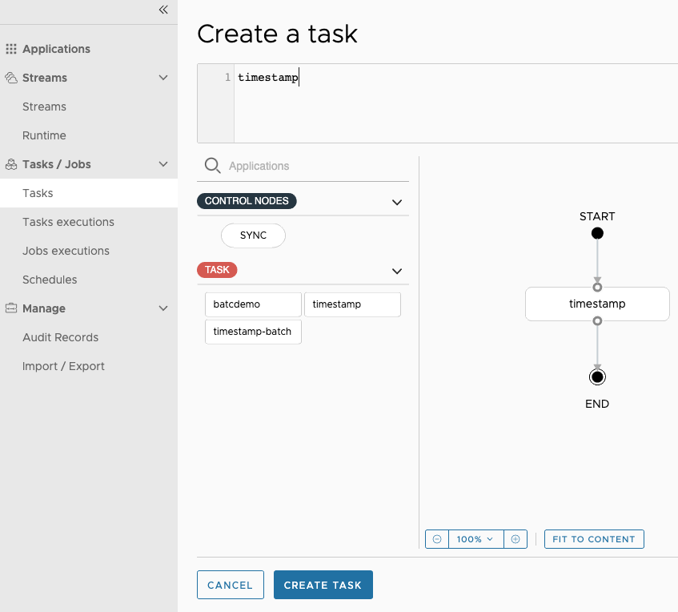
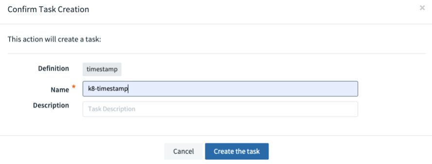

# Launching Apps Across Multiple Platforms

Spring Cloud Data Flow gives users the ability to orchestrate the launching of applications on different platforms from a single instance.
A platform in short is a location where an application can be launched. So for this document a platform can be Kubernetes cluster/namespace, Cloud Foundry organization/space, or a physical server.
The purpose of this document is to showcase a couple of ways to take advantage of deploying across multiple platforms.

## Launching Tasks Across Multiple Kubernetes Name Spaces


In this scenario a Spring Cloud Data Flow is running in a Kubernetes cluster in the default namespace and the user wants to be able to launch tasks in both the default and practice namespaces.
For this exercise we will deploy Spring Cloud Data Flow using SCDF's provided yaml files onto minikube.

### Configuring Spring Cloud Data Flow and Setup the Environment

1. Download the SCDF repository as shown in this [Deploying With kubectl](https://dataflow.spring.io/docs/installation/kubernetes/kubectl/#deploying-with-kubectl).
   But before continuing to the `Choose a Message Broker` section, we need to create the namespaces and add the platform configuration to Spring Cloud Data Flow.
1. Create the `practice` namespace (`default` is already created for you) using the following command:

```shell script
kubectl create namespace practice
```

1. Configure the platforms that Spring Cloud Data Flow will use. Using a text editor open the `<{>SCDF Dir>/src/kubernetes/server/server-deployment.yaml` file and replace the `SPRING_APPLICATION_JSON` property with the following value:

```yaml
- name: SPRING_APPLICATION_JSON
  value: '{ "maven": { "local-repository": null, "remote-repositories": { "repo1": { "url": "https://repo.spring.io/libs-snapshot"} } },"spring.cloud.dataflow.task":{"platform.kubernetes.accounts":{"default":{"namespace" : "default"},"practice":{"namespace" : "practice"}}} }'
```

2. Continue following the instruction picking up at the [Choose a Message Broker](https://dataflow.spring.io/docs/installation/kubernetes/kubectl/#choose-a-message-broker) till all steps are completed.
3. To allow Spring Cloud Data Flow to launch tasks across multiple namespaces the RBAC policy for Spring Cloud Data Flow service needs to be updated.

```shell script
kubectl create clusterrolebinding scdftestrole --clusterrole cluster-admin --user=system:serviceaccount:default:scdf-sa
```

[[note]]
| Setting the cluster role to `cluster-admin` for the `scdf-sa` user is not something that is recommended for production, but in this case it is meant for demo purposes.

### Registering Pre-built Tasks

This exercise will use the pre-built timestamp application provided by Spring Cloud Data Flow. If you haven't already registered your pre-built task applications, then follow the following instructions:

1. Bring up the Spring Cloud Data Flow UI in a browser.
1. Click the `Apps` tab located on the left side of the page.
   
1. Click the `Add Application(s)` button at the top of the page.
   
1. When the `Add Applications(s)` page appears click the `Bulk import application` radio button
   
1. Click `Task Apps (Docker)` option link.
   
1. Click the `Import the application(s)` button on the bottom of the page.
   

### Create Task Definitions

In this section we will create two task definitions: `timestamp-task` and `timestamp-task-2`. Each task definition will be launched on a specific platform.

To create the `timestamp-task` definition follow the instructions below:

1. Click the `Tasks` tab on the left side of the UI.  
   
1. Click the `Create task(s)" button on the page.
   
1. Type the word `timestamp` in the text box, then click the `Create Task` button.
   
1. When the`Confirm Task Creation` dialog appears enter the following into the `Name` field: `timestamp-task`. Then click the `Create the task` button.
   

To create the `timestamp-task-2` definition follow the `timestamp-task` instructions above except for the step when the `Confirm Task Creation` dialog appears, the name will be `timestamp-task-2`.

Now both task definitions will be available as shown below:  


### Launching Tasks

In this section we will launch `timestamp-task` in the default platform and then launch timestamp-task-2 in the practice platform.

1. Click the play button associated with the `timestamp-task` task definition
   
1. Now select the platform you want the `timestamp-task` to be launched, in this case the `default` namespace.
   
1. Click the `Launch the task` button at the bottom of the page.

To verify the pod executed you can view the result via the task execution page or by launching the following `kubectl` command to view the pods in the `default` namespace:

```shell script
kubectl get pods --namespace default
NAME                         READY   STATUS      RESTARTS   AGE
mysql-b94654bd4-k8vr7        1/1     Running     1          7h38m
rabbitmq-545bb5b7cb-dn5rd    1/1     Running     39         124d
scdf-server-dff599ff-68949   1/1     Running     0          8m27s
skipper-6b4d48ddc4-9p2x7     1/1     Running     0          12m
timestamp-task-v9jrm66p55    0/1     Completed   0          87s
```

Now to launch a task in the practice name space follow the instructions below:

1. Click the play button associated with the `timestamp-task-2` task definition
   
1. Now select the platform you want the `timestamp-task` to be launched, in this case the `default` namespace.
   
1. Click the `Launch the task` button at the bottom of the page.

To verify the pod executed you can view the result via the task execution page or by launching the following `kubectl` command to view the pods in the `default` namespace:

```shell script
kubectl get pods --namespace practice
NAME                          READY   STATUS      RESTARTS   AGE
timestamp-task-2-nwvk4r89vy   0/1     Completed   0          59s
```

### Scheduling Tasks

In this section we will create 2 schedules, each schedule will be created on a different platform.
Using Spring Cloud Data Flow's shell we will create a schedule that will launch the `timestamp-task` once a minute on the `default` platform.

1. To schedule the task, the following command needs to be run from the Spring Cloud Data Flow shell:

```shell script
task schedule create --name timestamp-task-sched --definitionName timestamp-task --expression "*/1 * * * *" --platform default
```

It will look something like this:

```shell script
dataflow:>task schedule create --name timestamp-task-sched --definitionName timestamp-task --expression "*/1 * * * *" --platform default
Created schedule 'timestamp-task-sched'
```

2. Verify that the schedule was created by running the `task schedule list --platform default` command as shown below.

```shell script
dataflow:>task schedule list --platform default
╔════════════════════╤════════════════════╤════════════════════════════════════════════════════╗
║   Schedule Name    │Task Definition Name│                     Properties                     ║
╠════════════════════╪════════════════════╪════════════════════════════════════════════════════╣
║timestamp-task-sched│timestamp-task      │spring.cloud.scheduler.cron.expression = */1 * * * *║
╚════════════════════╧════════════════════╧════════════════════════════════════════════════════╝
```

3. To verify that the scheduled app was properly created and being launched by the CronJob, you can view the result by running the following command `task execution list` from the SCDF shell.
   Or run the following `kubectl` command and you will see the timestamp-task-sched pods start appearing after 1 minute.

```shell script
kubectl get pods --namespace default
NAME                                    READY   STATUS      RESTARTS   AGE
mysql-b94654bd4-k8vr7                   1/1     Running     1          29h
rabbitmq-545bb5b7cb-dn5rd               1/1     Running     39         125d
scdf-server-845879c9b7-xs8t6            1/1     Running     3          4h45m
skipper-6b4d48ddc4-bkvph                1/1     Running     0          4h48m
timestamp-task-sched-1591904880-p48cx   0/1     Completed   0          33s
```

4. To delete the schedule execute the following command:

```shell script
dataflow:>task schedule destroy --name timestamp-task-sched --platform default
Deleted task schedule 'timestamp-task-sched'
```

Using Spring Cloud Data Flow's shell we will create a schedule that will launch the `timestamp-task-2` once a minute on the `practice` platform.

1. To schedule the task, the following command needs to be run from the Spring Cloud Data Flow shell:

```shell script
task schedule create --name timestamp-task-2-sched --definitionName timestamp-task --expression "*/1 * * * *" --platform practice
```

It will look something like this:

```shell script
dataflow:>task schedule create --name timestamp-task-2-sched --definitionName timestamp-task --expression "*/1 * * * *" --platform practice
Created schedule 'timestamp-task-2-sched'
```

2. Verify that the schedule was created by running the `task schedule list --platform practice` command as shown below.

```shell script
dataflow:>task schedule list --platform practice
╔══════════════════════╤════════════════════╤════════════════════════════════════════════════════╗
║    Schedule Name     │Task Definition Name│                     Properties                     ║
╠══════════════════════╪════════════════════╪════════════════════════════════════════════════════╣
║timestamp-task-2-sched│timestamp-task-2    │spring.cloud.scheduler.cron.expression = */1 * * * *║
╚══════════════════════╧════════════════════╧════════════════════════════════════════════════════╝
```

3. You can verify the result by running the following command `task execution list` from the SCDF shell. Or by launching the `kubectl` command with the following command and view the result.

```shell script
glennrenfro ~/scripts: kubectl get pods --namespace practice
NAME                                      READY   STATUS      RESTARTS   AGE
timestamp-task-2-sched-1591905600-rnfks   0/1     Completed   0          17s
```

4. To delete the schedule execute the following command:

```shell script
dataflow:>task schedule destroy --name timestamp-task-2-sched --platform practioce
Deleted task schedule 'timestamp-task-2-sched'
```

## Launching Tasks Across Multiple Platforms from an external Spring Cloud Data Flow


In this scenario a Spring Cloud Data Flow and its data store are running outside the Kubernetes cluster and the user wants to be able to launch tasks in both the default and practice namespaces, while being able to monitor the task execution from SCDF.

### Configuring Spring Cloud Data Flow

For this exercise the user will need to have access to a shell.
Establish environment properties for Spring Cloud Data Flow and launch it as shown below:

```shell script
export spring_datasource_url=<your database url>
export spring_datasource_username=<your username>
export spring_datasource_password=<your password>
export spring_datasource_driverClassName=<your driverClassName>
export spring_profiles_active=cloud
export jbp_config_spring_auto_reconfiguration='{enabled: false}'
export spring_cloud_dataflow_features_schedulesEnabled=true
export spring_cloud_dataflow_features_tasks_enabled=true
export SPRING_APPLICATION_JSON="{\"spring.cloud.dataflow.task\":{\"platform.local.accounts\":{\"default\":{\"timeout\" : \"60\"}},\"platform.kubernetes.accounts\":{\"kzone\":{\"namespace\" : \"default\"},\"practice\":{\"namespace\" : \"practice\"}}}}"

java -jar spring-cloud-dataflow-server/target/spring-cloud-dataflow-server-<version>.jar
```

### Configuring Database Service in Kubernetes to Connect to External Database

The tasks that are launched in this exercise need to have access to a database service that connects to the external database that is being used by SCDF.
To do this, we will create a database service along with an endpoint that refers to the external database. For this example we will be connecting to a MySql database.

1. Setup database service

```yaml
apiVersion: v1
kind: Service
metadata:
  name: mysql-mac
spec:
  ports:
    - protocol: TCP
      port: 1443
      targetPort: 3306
```

2. Setup endpoint to your local MySql

```yaml
apiVersion: v1
kind: Endpoints
metadata:
  name: mysql-mac
subsets:
  - addresses:
      - ip: 192.168.1.72
    ports:
      - port: 3306
```

3. Now let us obtain the `cluster ip` for the newly created `mysql-mac` service so that we can use it for launching and scheduling tasks. This is done by launching the following command (in this case a MySql instance running on my machine):

```shell script
kubectl get svc mysql-mac
```

The result of this command will look something like:

```shell script
NAME        TYPE        CLUSTER-IP      EXTERNAL-IP   PORT(S)    AGE
mysql-mac   ClusterIP   <ext db conn>   <none>        1443/TCP   44m
```

### Registering Apps

To register the applications needed for the exercise follow the instructions in this [section](#registering-pre-built-tasks).

### Launching Tasks

Add the following commandline arg when launching the task (replacing `<ext db conn>` with the CLUSTER-IP provided by the `kubectl get svc mysql-mac`):
`--spring.datasource.url=jdbc:mysql://<ext db conn>:1443/<your db>`.
It should look something like:


To verify the task was launched select the task executions tab at the top of the page and you will see results that look like:


Also you can verify the launch by viewing the pod list for the `default` namespace for example:

```shell script
kubectl get pods --namespace default
NAME                          READY   STATUS      RESTARTS   AGE
timestamp-task-kzkpqjp936     0/1     Completed   0          38s
```

Add the following command line arg when launching the task:
`--spring.datasource.url=jdbc:mysql://<ext db conn>:1443/<your db>`.
It should look something like:


To verify the task was launched select the task executions tab at the top of the page and you will see results that look like:


Also you can verify the launch by viewing the pod list for the `practice` namespace for example:

```shell script
kubectl get pods --namespace practice
NAME                          READY   STATUS      RESTARTS   AGE
timestamp-task-2-pkwzevl0mp   0/1     Completed   0          48s
```

### Scheduling Tasks

In this section we will create 2 schedules, each schedule will be created on a different platform.
Using Spring Cloud Data Flow's shell we will create a schedule that will launch the `timestamp-task` once a minute on the `default` platform.

1. To schedule the task, the following command needs to be run from the Spring Cloud Data Flow shell:

```shell script
task schedule create --name timestamp-task-sched --definitionName timestamp-task --expression "*/1 * * * *" --platform default --properties "app.docker-timestamp.spring.datasource.url=jdbc:mysql://<ext db conn>:1443/<your db>"
```

It will look something like this:

```shell script
dataflow:>task schedule create --name timestamp-task-sched --definitionName timestamp-task --expression "*/1 * * * *" --platform default --properties "app.docker-timestamp.spring.datasource.url=jdbc:mysql://10.100.231.80:1443/task"
Created schedule 'timestamp-task-sched'
```

2. Verify that the schedule was created, run the`task schedule list --platform default` command and view the result as shown below:

```shell script
dataflow:>task schedule list --platform default
╔════════════════════╤════════════════════╤════════════════════════════════════════════════════╗
║   Schedule Name    │Task Definition Name│                     Properties                     ║
╠════════════════════╪════════════════════╪════════════════════════════════════════════════════╣
║timestamp-task-sched│timestamp-task      │spring.cloud.scheduler.cron.expression = */1 * * * *║
╚════════════════════╧════════════════════╧════════════════════════════════════════════════════╝
```

3. To verify that the scheduled app was properly created and being launched by the CronJob, you can run the `task execution list` from the SCDF Shell, or run the following `kubectl` command and you will see the timestamp-task-sched pods start appearing after 1 minute.

```shell script
kubectl get pods --namespace default
NAME                                    READY   STATUS      RESTARTS   AGE
timestamp-task-sched-1592229780-f5w6w   0/1     Completed   0          15s
```

4. To delete the schedule execute the following command:

```shell script
dataflow:>task schedule destroy --name timestamp-task-sched --platform default
Deleted task schedule 'timestamp-task-sched'
```

Using Spring Cloud Data Flow's shell we will create a schedule that will launch the `timestamp-task-2` once a minute on the `practice` platform.

1. To schedule the task, the following command needs to be run from the Spring Cloud Data Flow shell:

```shell script
task schedule create --name timestamp-task-2-sched --definitionName timestamp-task --expression "*/1 * * * *" --platform practice --properties "app.docker-timestamp.spring.datasource.url=jdbc:mysql://<ext db conn>:1443/<your db>"
```

It will look something like this:

```shell script
dataflow:>task schedule create --name timestamp-task-2-sched --definitionName timestamp-task --expression "*/1 * * * *" --platform practice --properties "app.docker-timestamp.spring.datasource.url=jdbc:mysql://10.100.231.80:1443/task"
Created schedule 'timestamp-task-2-sched'
```

2. Verify that the schedule was created, run the`task schedule list --platform practice` command and view the result as shown below:

```shell script
dataflow:>task schedule list --platform practice
╔══════════════════════╤════════════════════╤════════════════════════════════════════════════════╗
║    Schedule Name     │Task Definition Name│                     Properties                     ║
╠══════════════════════╪════════════════════╪════════════════════════════════════════════════════╣
║timestamp-task-2-sched│timestamp-task-2    │spring.cloud.scheduler.cron.expression = */1 * * * *║
╚══════════════════════╧════════════════════╧════════════════════════════════════════════════════╝

dataflow:>task schedule destroy --name timestamp-task-2-sched --platform practice
Deleted task schedule 'timestamp-task-2-sched'
```

3. To verify that the scheduled app was properly created and being launched by the CronJob, you can run the `task execution list` from the SCDF Shell, or run the following `kubectl` command and you will see the timestamp-task-sched pods start appearing after 1 minute.

```shell script
glennrenfro ~/scripts: kubectl get pods --namespace practice
NAME                                      READY   STATUS      RESTARTS   AGE
timestamp-task-2-sched-1592230980-bngbc   0/1     Completed   0          19s
```

4. To delete the schedule execute the following command:

```shell script
dataflow:>task schedule destroy --name timestamp-task-2-sched --platform practice
Deleted task schedule 'timestamp-task-2-sched'
```

## Launching Tasks on different types of platforms


In this scenario a Spring Cloud Data Flow is running outside of Kubernetes and Cloud Foundry and the user wants to be able to launch tasks on both platforms.

### Configuring Spring Cloud Data Flow

For this exercise the user will need to have access to a shell. Establish environment properties for Spring Cloud Data Flow and launch it as shown below:

```shell script
export spring_datasource_url=<your database url>
export spring_datasource_username=<your username>
export spring_datasource_password=<your password>
export spring_datasource_driverClassName=<your database driverClassNanme>
export spring_profiles_active=cloud
export jbp_config_spring_auto_reconfiguration='{enabled: false}'
export spring_cloud_dataflow_features_schedulesEnabled=true
export spring_cloud_dataflow_features_tasks_enabled=true
export SPRING_APPLICATION_JSON="{\"spring.cloud.dataflow.task\":{\"platform.kubernetes.accounts\":{\"kzone\":{\"namespace\" : \"default\"}},\"platform.cloudfoundry.accounts\":{\"cfzone\":{\"connection\":{\"url\":\"https://myconnection\",\"domain\":\"mydomain\",\"org\":\"myorg\",\"space\":\"myspace\",\"username\":\"admin\",\"password\":\"password\",\"skipSslValidation\":true},\"deployment\":{\"deleteRoutes\":false,\"services\":\"garsql,atscheduler\",\"enableRandomAppNamePrefix\":false,\"memory\":3072},\"schedulerProperties\":{\"schedulerUrl\":\"https://scheduler.cf.navy.springapps.io\"}}}}}{\"spring.cloud.dataflow.task\":{\"platform.kubernetes.accounts\":{\"kzone\":{\"namespace\" : \"default\"}}}}{\"spring.cloud.dataflow.task\":{\"platform.local.accounts\":{\"local\":{\"timeout\" : \"60\"}}}}"

java -jar spring-cloud-dataflow-server/target/spring-cloud-dataflow-server-2.6.0.BUILD-SNAPSHOT.jar
```

[[note]]
|This exercise assumes that the user has an external database that is accessible from both the Cloud Foundry and Kubernetes environments.

### Registering Apps

In this exercise SCDF will be launching both docker and maven images of the timestamp application.

1. Register the sample docker task apps provided by SCDF as denoted in the instructions [here](#registering-pre-built-tasks).
1. Register the maven instance of timestamp as follows:
   
1. Click the `Add Application(s)` button at the top of the page.
   
1. When the `Add Applications(s)` page appears click the `Register one or more applications` radio button
   
1. Enter in the information as it is shown below.
   
1. Click the `Register the application(s)` button on the bottom of the page.
   

### Create Task Definitions

In this section we will create two task definitions: `timestamp-task` and `timestamp-task-2`. Each task definition will be launched on a specific platform.

To create the `k8-timestamp` definition follow the instructions below:

1. Click the `Tasks` tab on the left side of the UI.  
   
1. Click the `Create task(s)" button on the page.
   
1. Type the word `timestamp` in the text box, then click the `Create Task` button.
   
1. When the`Confirm Task Creation` dialog appears enter the following into the `Name` field: `timestamp-task`. Then click the `Create the task` button.
   

To create the `cf-timestamp` definition follow the instructions below:

1. Click the `Tasks` tab on the left side of the UI.  
   
1. Click the `Create task(s)" button on the page.
   
1. Type the word `maven-timestamp` in the text box, then click the `Create Task` button.
   
1. When the`Confirm Task Creation` dialog appears enter the following into the `Name` field: `timestamp-task`. Then click the `Create the task` button.
   

Now both task definitions will be available as shown below:  


### Launching Tasks

In this section we will launch `cf-timestamp` on the `cfzone` (Cloud Foundry) platform and then launch k8-timestamp on the `kzone` (Kuberntes) platform.

1. Click the play button associated with the `cf-timestamp` task definition
   
1. Now select the platform you want the `cf-timestamp` to be launched, in this case the `cfzone` namespace.
   
1. Click the `Launch the task` button at the bottom of the page.

To verify the application executed you can view the result via the task execution page or by launching the following `cf apps` command to view the application in the configured org/space:

```shell script
cf tasks cf-timestamp
Getting tasks for app cf-timestamp in org scheduling / space glenn as admin...
OK

id   name                                                                          state       start time                      command
7    cf-timestamp                                                                  SUCCEEDED   Mon, 15 Jun 2020 18:09:00 UTC   JAVA_OPTS="-agentpath:$PWD/.java-buildpack/open_jdk_jre/bin/jvmkill-1.16.0_RELEASE=printHeapHistogram=1 -Djava.io.tmpdir=$TMPDIR -XX:ActiveProcessorCount=$(nproc) -Djava.ext.dirs=$PWD/.java-buildpack/container_security_provider:$PWD/.java-buildpack/open_jdk_jre/lib/ext -Djava.security.properties=$PWD/.java-buildpack/java_security/java.security $JAVA_OPTS" && CALCULATED_MEMORY=$($PWD/.java-buildpack/open_jdk_jre/bin/java-buildpack-memory-calculator-3.13.0_RELEASE -totMemory=$MEMORY_LIMIT -loadedClasses=14335 -poolType=metaspace -stackThreads=250 -vmOptions="$JAVA_OPTS") && echo JVM Memory Configuration: $CALCULATED_MEMORY && JAVA_OPTS="$JAVA_OPTS $CALCULATED_MEMORY" && MALLOC_ARENA_MAX=2 SERVER_PORT=$PORT eval exec $PWD/.java-buildpack/open_jdk_jre/bin/java $JAVA_OPTS -cp $PWD/. org.springframework.boot.loader.JarLauncher
```

Now to launch a task in the default name space on the `kzone` (kubernetes) platform follow the instructions below:

1. Click the play button associated with the `timestamp-task-2` task definition
   
1. Now select the platform you want the `timestamp-task` to be launched, in this case the `default` namespace.
   
1. Click the `Launch the task` button at the bottom of the page.

To verify the pod executed you can view the result via the task execution page or by launching the following `kubectl` command to view the pods in the `default` namespace:

```shell script
kubectl get pods
NAME                        READY   STATUS      RESTARTS   AGE
k8-timestamp-rpqw00d175     0/1     Completed   0          39s
```

### Scheduling Tasks

In this section we will create 2 schedules, each schedule will be created on a different platform.
Using Spring Cloud Data Flow's shell we will create a schedule that will launch the `cf-timestamp` task definition once a minute on the `cfzone` Cloud Foundry platform and a `k8-timestamp` task definition on the `default` namespace of a minikube.

1. Create the schedule for the Cloud Foundry platform.

```shell script
task schedule create --name timestamp-task-cf-sched --definitionName cf-timestamp --expression "*/1 * ? * *"  --platform cfzone --properties "app.maven-timestamp.spring.datasource.url=<your database url>"
```

1. Verify that the schedule was created, run the`task schedule list --platform cfzone` command and view the result as shown below:

```shell script
task schedule list --platform cfzone
╔═══════════════════════╤════════════════════╤════════════════════════════════════════════════════╗
║     Schedule Name     │Task Definition Name│                     Properties                     ║
╠═══════════════════════╪════════════════════╪════════════════════════════════════════════════════╣
║timestamp-task-cf-sched│cf-timestamp        │spring.cloud.scheduler.cron.expression = */1 * ? * *║
╚═══════════════════════╧════════════════════╧════════════════════════════════════════════════════╝
```

1. Now verify that the app that was defined by the task definition has been deployed to the Cloud Foundry by executing the `cf apps` command on the org/space that you configured.

```shell script
cf apps
Getting apps in org scheduling / space glenn as admin...
name                    requested state   instances   memory   disk   urls
cf-timestamp            stopped           0/1         3G       1G
```

1. Verify that the scheduled `timestamp-task-cf-sched` actually launched by launching the `cf job-history timestamp-task-cf-sched` command on the org/space you configured.

```shell script
cf job-history timestamp-task-cf-sched
Getting scheduled job history for timestamp-task-cf-sched in org scheduling / space glenn as admin
1 - 6 of 6 Total Results
Execution GUID                         Execution State   Scheduled Time                  Execution Start Time            Execution End Time              Exit Message
4c588ee2-833d-47a6-84cb-ebfcc90857e9   SUCCEEDED         Mon, 15 Jun 2020 18:07:00 UTC   Mon, 15 Jun 2020 18:07:00 UTC   Mon, 15 Jun 2020 18:07:00 UTC   202 - Cloud Controller Accepted Task
```

1. Now delete the schedule using the SCDF shell `task schedule destroy` command.

````shell script
```shell script
task schedule destroy --name timestamp-task-k8-sched --platform kzone
Deleted task schedule 'timestamp-task-k8-sched'
````

1. Create the schedule for the Kubernetes platform.

```shell script
task schedule create --name timestamp-task-k8-sched --definitionName k8-timestamp --expression "*/1 * * * *" --platform kzone --properties "app.timestamp.spring.datasource.url=<your database url>"
```

1. Verify that the schedule was created, run the`task schedule list --platform kzone` command and view the result as shown below:

```shell script
task schedule list --platform kzone
╔═══════════════════════╤════════════════════╤════════════════════════════════════════════════════╗
║     Schedule Name     │Task Definition Name│                     Properties                     ║
╠═══════════════════════╪════════════════════╪════════════════════════════════════════════════════╣
║timestamp-task-k8-sched│k8-timestamp        │spring.cloud.scheduler.cron.expression = */1 * * * *║
╚═══════════════════════╧════════════════════╧════════════════════════════════════════════════════╝
```

1. Now verify that the app that was defined by the task definition has been deployed to the kubernetes by executing the `kubectl get pods` command on the default namespace.

```shell script
glennrenfro ~/scripts: kubectl get pods
NAME                                       READY   STATUS      RESTARTS   AGE
timestamp-task-k8-sched-1592246880-4fx2p   0/1     Completed   0          14s
```

1.  Now delete the schedule using the SCDF shell `task schedule destroy` command.

```shell script
task schedule destroy --name timestamp-task-k8-sched --platform kzone
Deleted task schedule 'timestamp-task-k8-sched'
```
